# 🏗 Golden Tops Website

A modern, high-performance contracting and construction company website built using **Next.js**.
The platform showcases company services, portfolio projects, and client trust through a clean, scalable, and SEO-friendly architecture.

---

## 🚀 Live Demo

🔗 https://golden-tops-website.vercel.app/en

---

## 📌 Overview

Golden Tops is a premium contracting and finishing company.
This website was designed to reflect **professionalism, trust, and high-quality execution** while providing a seamless user experience across all devices.

The project focuses on:

- Strong visual identity
- Clear service presentation
- Scalable architecture
- SEO optimization

---

## 🚀 Features

- 🌐 Multi-language support (English / Arabic - RTL)
- 🎨 Modern UI with Tailwind CSS
- 📱 Fully responsive design (Mobile / Tablet / Desktop)
- 🏗 Services listing with detailed pages
- 📂 Projects portfolio with gallery view
- ⭐ Client testimonials section
- 🤝 Partners & clients showcase
- 📊 Company statistics (dynamic UI blocks)
- 📞 Contact page with form & Google Maps integration
- ⚡ High performance using Next.js App Router
- 🔍 SEO optimized structure

---

## 🛠 Tech Stack

- **Framework:** Next.js (App Router)
- **Language:** TypeScript
- **Styling:** Tailwind CSS
- **UI:** React
- **Routing:** App Router (Next.js 13+)
- **SEO:** Metadata API + SSR
- **Deployment:** Vercel (recommended)

---

## 🧱 Architecture Highlights

- Component-based architecture for reusability
- Separation between UI components and page structure
- Optimized asset handling (images & fonts)
- Scalable folder structure for future expansion
- Ready for CMS integration (Strapi / Headless CMS)

---

## 📂 Project Structure

```bash
/app                # Pages & routing (Next.js App Router)
/components         # Reusable UI components
/assets/images      # Project images & screenshots
/public             # Static assets
/styles             # Global styles
```

---

## 📸 Screenshots

## 🏠 Homepage

### 🌍 English

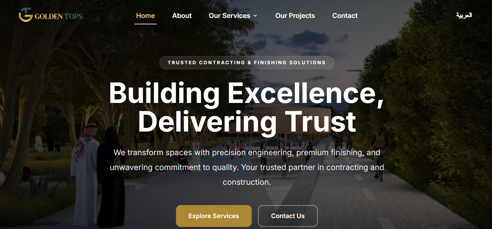

### 🌍 Arabic

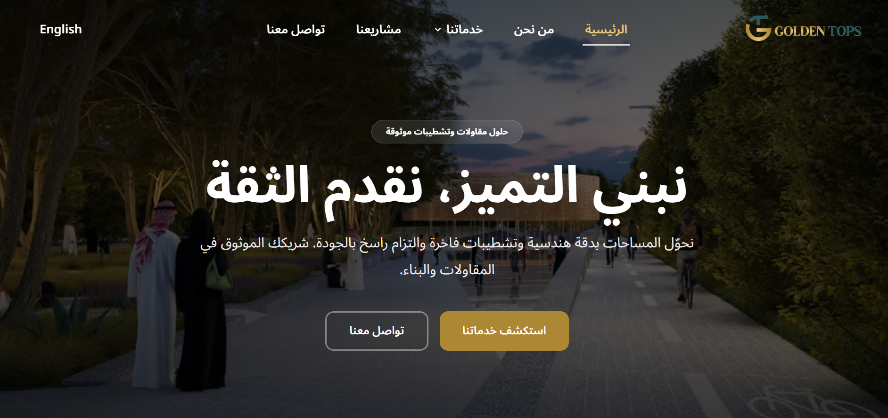

---

## 🧭 Navigation

### 📂 Services Dropdown

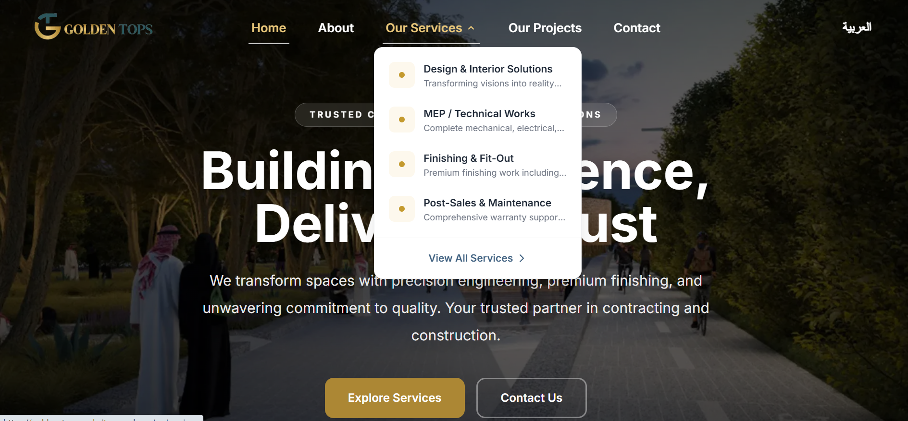

---

## 🧾 About Section

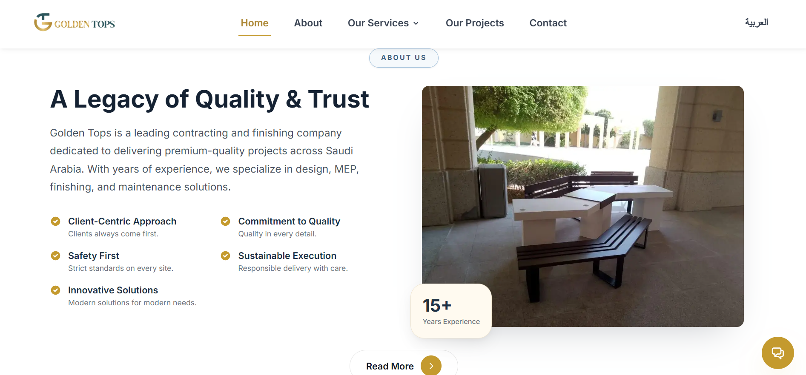

---

## 🛠 Services Section

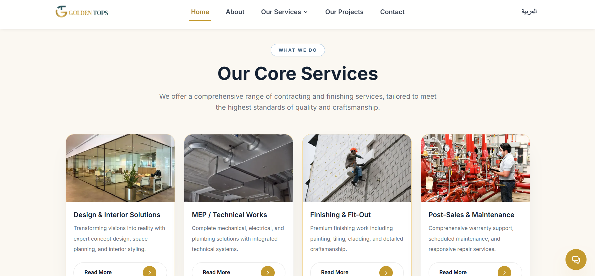

---

## 📊 Company Statistics

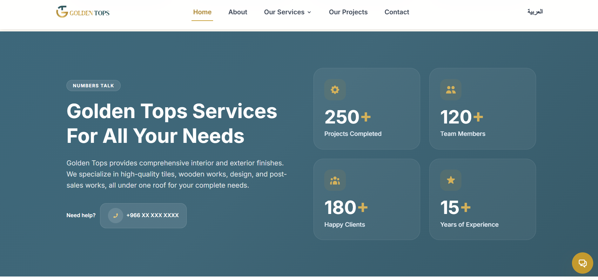

---

## 📁 Projects Portfolio

### 📌 Featured Projects

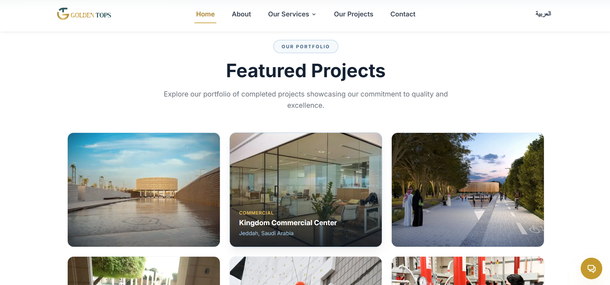

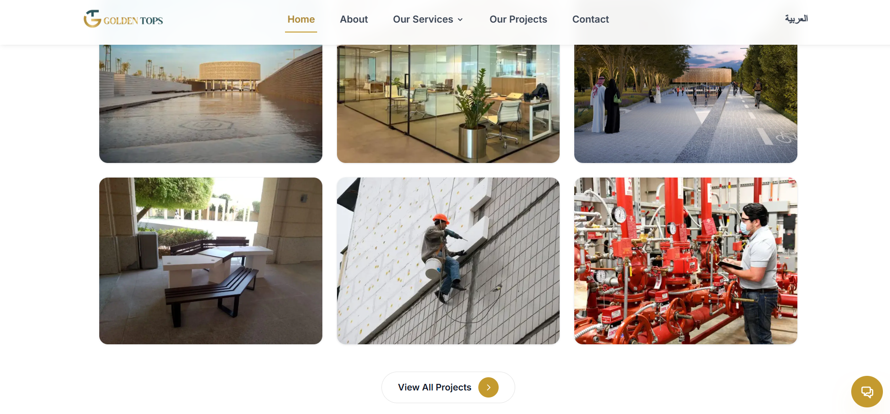

### 🌍 Arabic Version

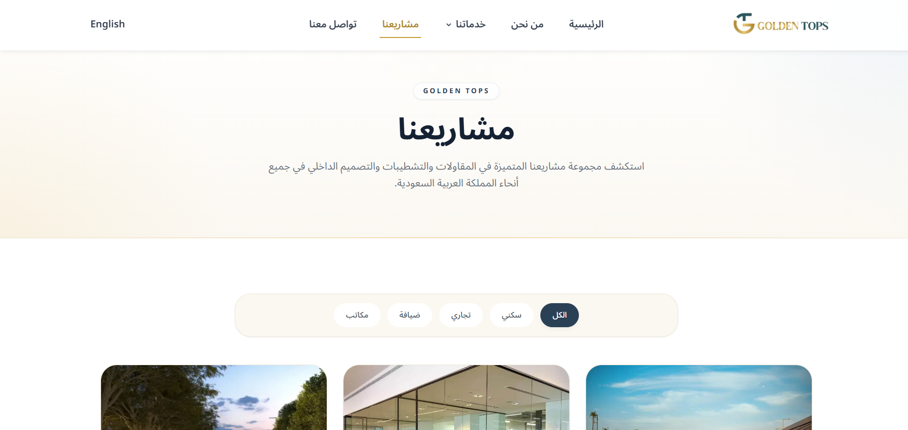

---

## 🤝 Clients & Partners

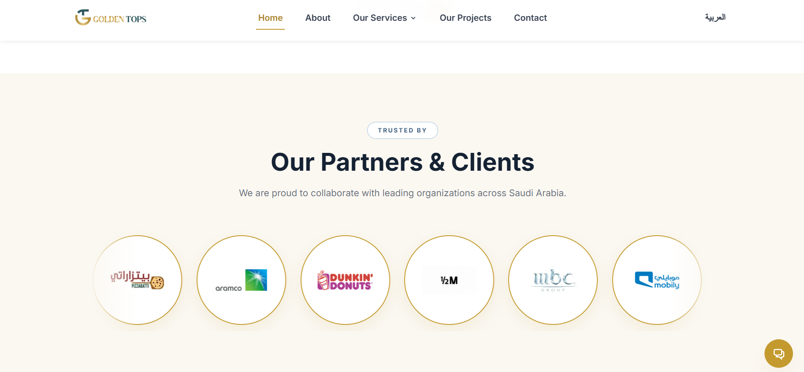

---

## ⭐ Testimonials

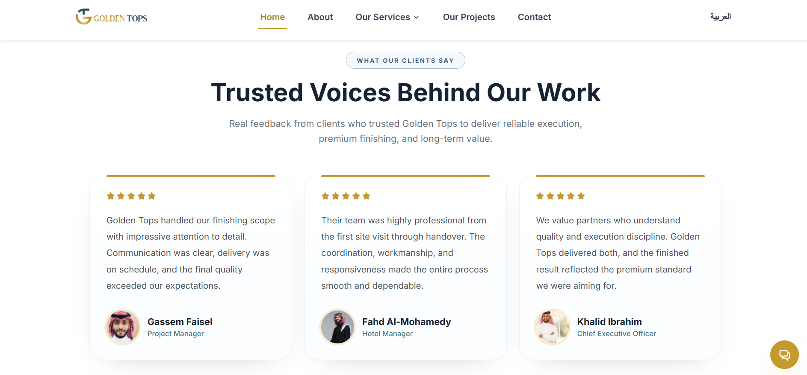

---

## 📞 Call To Action

### 🌍 English

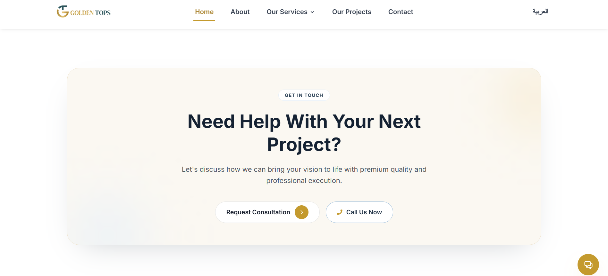

### 🌍 Arabic

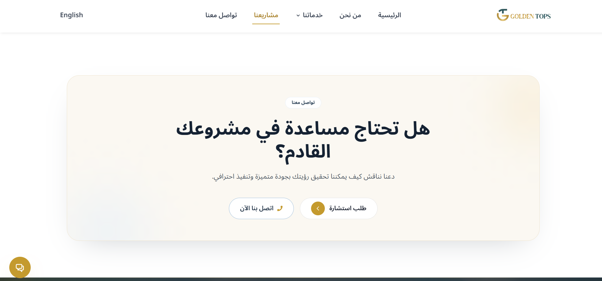

---

## 🦶 Footer

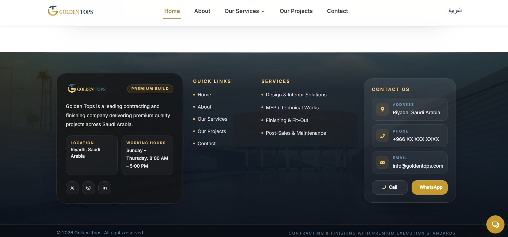

---

# 📄 Internal Pages

## 🛠 Services Page

### 🧾 Header

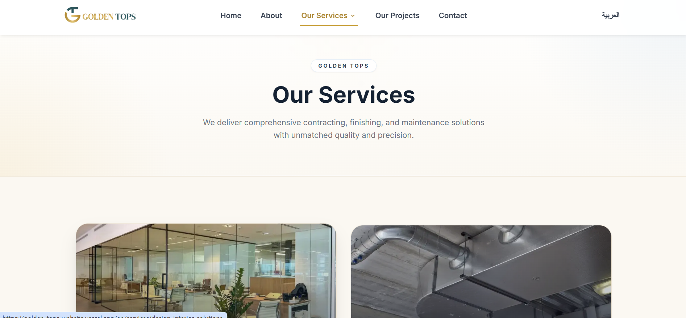

### 🛋 Service Details

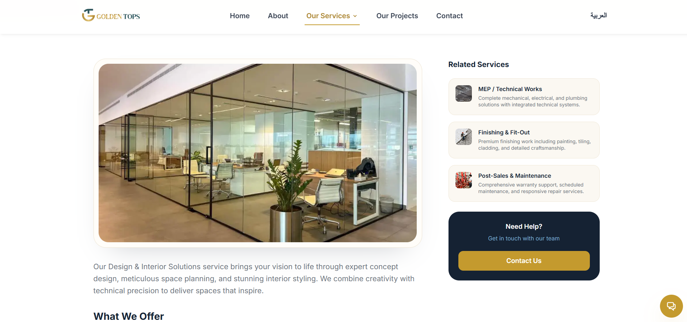

### ✅ Features & Benefits

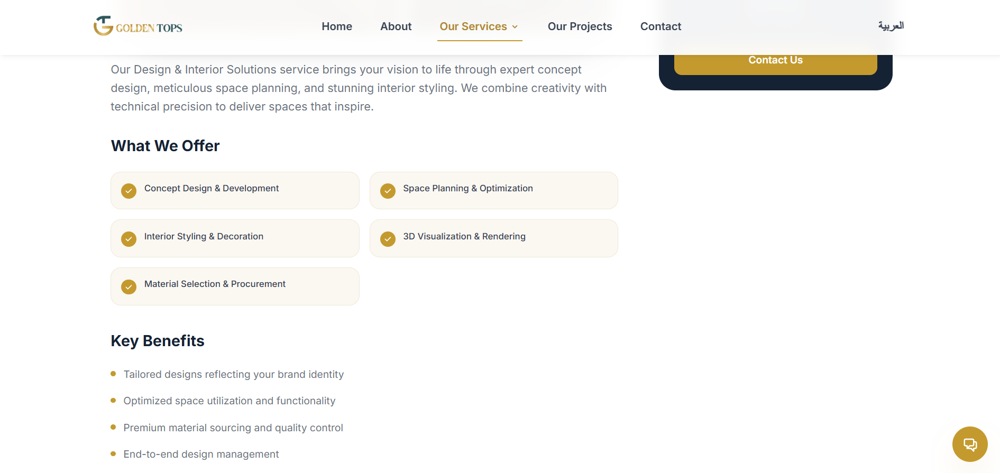

---

## 📬 Contact Page

### 📄 Header (EN)

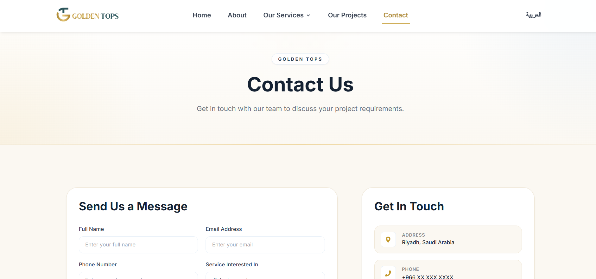

### 📄 Header (AR)

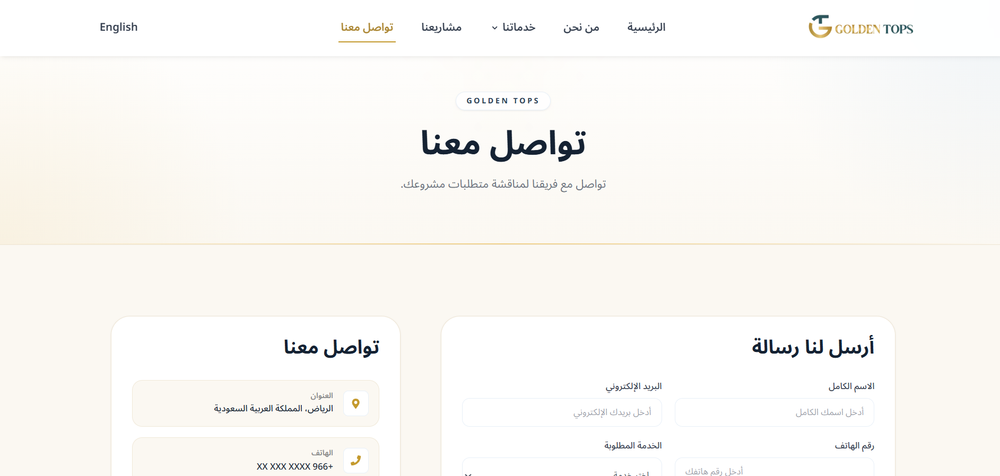

### 📝 Contact Form


### 🗺 Map Location

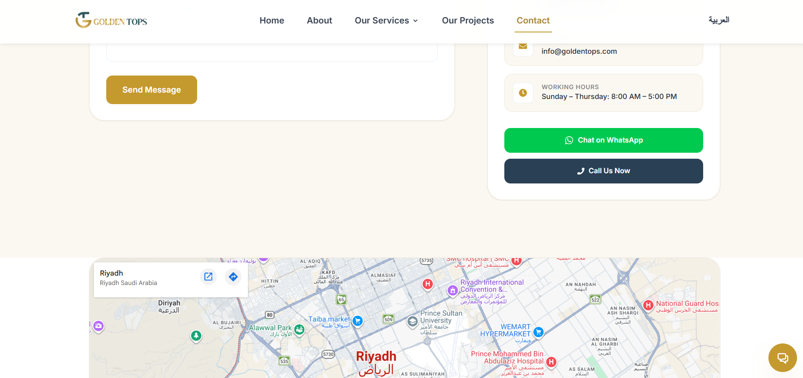

---

## ⚙️ Getting Started

### 1️⃣ Install dependencies

```bash
npm install
```

### 2️⃣ Run development server

```bash
npm run dev
```

### 3️⃣ Open in browser

```
http://localhost:3000
```

---

## 🚀 Deployment

The easiest way to deploy the project:

- **Vercel (Recommended)**
- Docker
- Any Node.js hosting provider

---

## 📈 SEO & Performance

- Server-Side Rendering (SSR)
- Optimized images & fonts
- Clean semantic HTML
- Metadata optimization
- Fast loading with Next.js

---

## 💡 Future Enhancements

- CMS integration (Strapi / Sanity)
- Admin dashboard
- Dynamic project management
- Blog / News section
- API integration for contact handling
